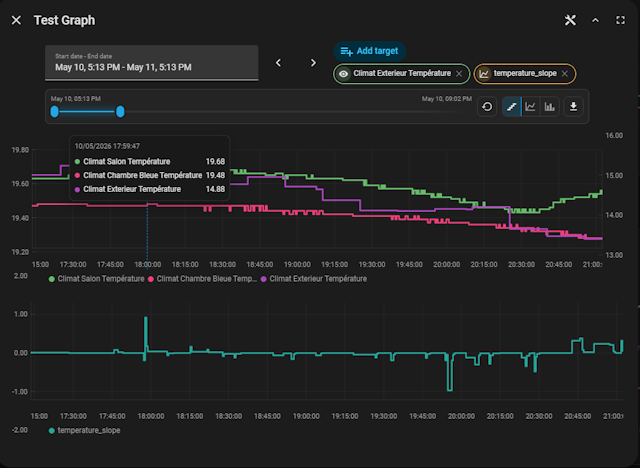
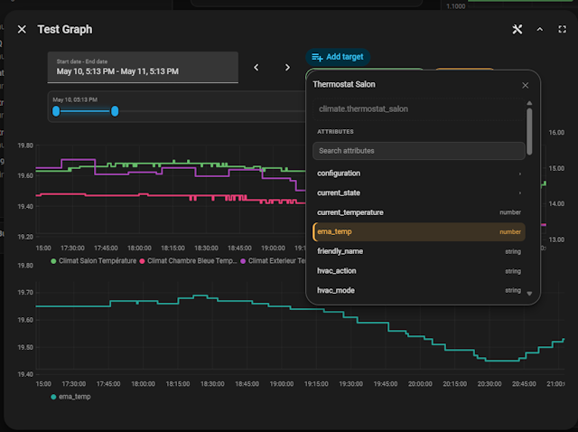
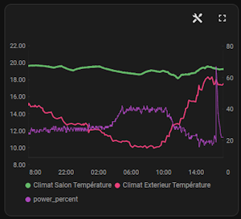
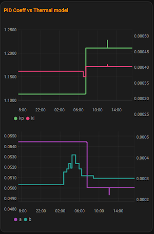
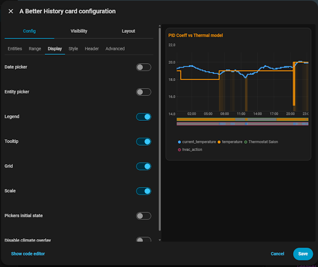

# a-better-history-card

A pair of Lovelace cards for Home Assistant that expose the full capabilities of the
[`@kipk/ha-better-history`](https://www.npmjs.com/package/@kipk/ha-better-history) web component —
multi-entity history graphs with per-series styling, scale groups, climate overlays, and more.

## Variants

| Card type                             | Description                                          |
| ------------------------------------- | ---------------------------------------------------- |
| `custom:a-better-history-card`        | Inline graph rendered directly in the Lovelace grid. |
| `custom:a-better-history-button-card` | Button that opens the graph in a dialog.             |

Both variants share the same configuration schema and the same visual editor.

---

## Features

### Entity attribute graphs — what native HA history cannot do

The native Home Assistant history panel only graphs **entity states**. Many of the most useful
values in HA live in **entity attributes** — the current temperature of a climate thermostat, the
battery level of a sensor, the power draw of a smart plug, the position of a cover, etc. These
are invisible to the built-in history.

`ha-better-history` graphs attributes as first-class series. You can mix state series and attribute
series on the same graph, with independent colors, labels, and Y-axis scale groups:

```yaml
series:
  - entity: climate.living_room
    attribute: current_temperature   # not visible in native HA history
    label: Indoor temp
    scale_group: temperature
  - entity: sensor.outdoor_temperature
    label: Outdoor temp
    scale_group: temperature         # shares the same Y-axis
```

> Because HA attributes carry no unit metadata, declare units via `attribute_units` so series
> can be matched onto a shared scale — see the [`attribute_units`](#data) option.

### Other highlights

- **Multi-entity, multi-attribute** — combine as many series as needed on one graph.
- **Scale groups** — group series onto a shared Y-axis by unit (e.g. all temperatures together, all humidity readings together).
- **Per-series styling** — color, line mode (stair / line / column), and line width per series.
- **Climate overlay** — heating/cooling state visualized as a background band on climate series.
- **Flexible time range** — rolling relative window (e.g. last 48 h) or fixed absolute date range, with an optional date-range picker in the graph.
- **Toolbar** — optional tools panel with zoom selector, line-mode buttons, CSV export/import.
- **Two card variants** — inline graph in the dashboard grid, or a button that opens a dialog.
- **Visual editor** — full tabbed UI editor; no YAML required.

---

## Screenshots

### Cards






### Configuration screen



---

## Installation

### Via HACS

[](https://my.home-assistant.io/redirect/hacs_repository/?owner=KipK&repository=a-better-history-card&category=Plugin)


1. Add this repository as a custom repository in HACS (type: **Dashboard**).
2. Install **a-better-history-card** from HACS.
3. Clear browser cache and reload Home Assistant.

### Manual

1. Download `a-better-history-card.js` from the latest release.
2. Copy it to `www/community/a-better-history-card/`.
3. Add it as a Lovelace resource:

```yaml
url: /local/community/a-better-history-card/a-better-history-card.js
type: module
```

---

## Configuration via UI

Both cards ship with a full visual editor accessible from the Lovelace card picker.
The editor is organized into tabs:

- **Entities** — add, remove, and reorder entity/attribute series using the series picker.
- **Range** — choose relative hours or an absolute date range with a date-range picker.
- **Display** — toggle date picker, entity picker, legend, tooltip, grid, scale, and climate overlay.
- **Style** — set global line mode, line width, and title appearance.
- **Header** — configure toolbar buttons (tools, controls toggle, fullscreen).
- **Button** _(button-card only)_ — set button label, icon, color, and hover effect.
- **Advanced** — enable `debug_performance` and configure `attribute_units`.

You can configure every option through the UI without writing any YAML.

---

## YAML Examples

### (a) Minimal inline graph card

```yaml
type: custom:a-better-history-card
entities:
  - sensor.outdoor_temperature
  - sensor.indoor_temperature
```

### (b) Rich inline graph — multi-entity with attribute series

```yaml
type: custom:a-better-history-card
title: Climate overview
range_mode: relative
hours: 48
show_legend: true
show_tooltip: true
show_grid: true
show_scale: true
show_date_picker: true
show_entity_picker: false
show_tools_button: true
show_controls_toggle: true
line_mode: line
line_width: 2
series:
  - entity: climate.living_room
    attribute: current_temperature
    label: Indoor temp
    color: "#42a5f5"
    scale_group: temperature
    line_mode: line
    line_width: 2.5
  - entity: climate.living_room
    attribute: humidity
    label: Humidity
    color: "#66bb6a"
    scale_group: humidity
    unit: "%"
  - entity: sensor.outdoor_temperature
    label: Outdoor temp
    color: "#ef5350"
    scale_group: temperature
attribute_units:
  climate.living_room.humidity: "%"
```

### (c) Button card

```yaml
type: custom:a-better-history-button-card
button_label: Show history
button_icon: mdi:chart-line
button_show_name: true
button_show_icon: true
button_hover_effect: true
entities:
  - sensor.power_consumption
range_mode: relative
hours: 24
show_legend: true
```

---

## Options Reference

All options are optional unless noted. Defaults come from `normalizeConfig()`.

### Data

| Option            | Type                     | Default | Description                                                                                                  |
| ----------------- | ------------------------ | ------- | ------------------------------------------------------------------------------------------------------------ |
| `entities`        | `string[]`               | —       | Shorthand list of entity IDs to graph as state series.                                                       |
| `series`          | `CardSeriesConfig[]`     | —       | Explicit series definitions (see [Series options](#series-options) below). Takes precedence over `entities`. |
| `attribute_units` | `Record<string, string>` | —       | Map of `entity_id.attribute` → unit string. Required for attribute series — see note below.                  |

> **Why `attribute_units` matters.**
> Entity _states_ in Home Assistant carry a `unit_of_measurement` attribute, so the component can
> read the unit automatically. Entity _attributes_ (e.g. `current_temperature` on a `climate`
> entity, `battery` on a device tracker, etc.) carry **no unit metadata** — Home Assistant simply
> does not expose it. Without a declared unit, `ha-better-history` cannot match the attribute
> against other series for Y-axis scale grouping or tooltip display.
>
> Declare the unit for every attribute series you want to match:
>
> ```yaml
> attribute_units:
>   climate.living_room.current_temperature: "°C"
>   climate.living_room.humidity: "%"
> ```
>
> The key format is `entity_id.attribute_name`. The value is the unit string shown in the tooltip
> and used to group series onto a shared Y-axis via `scale_group`.

### Range

| Option       | Type                         | Default      | Description                                             |
| ------------ | ---------------------------- | ------------ | ------------------------------------------------------- |
| `range_mode` | `"relative"` \| `"absolute"` | `"relative"` | Relative rolling window or fixed absolute date range.   |
| `hours`      | `number`                     | `24`         | Window size in hours when `range_mode` is `"relative"`. |
| `start_date` | ISO string                   | —            | Range start when `range_mode` is `"absolute"`.          |
| `end_date`   | ISO string                   | —            | Range end when `range_mode` is `"absolute"`.            |

### Display

| Option                     | Type      | Default | Description                                                                                    |
| -------------------------- | --------- | ------- | ---------------------------------------------------------------------------------------------- |
| `show_date_picker`         | `boolean` | `false` | Show the date-range picker control inside the graph.                                           |
| `show_entity_picker`       | `boolean` | `false` | Show the entity/attribute picker control inside the graph.                                     |
| `show_legend`              | `boolean` | `true`  | Show the series legend.                                                                        |
| `show_tooltip`             | `boolean` | `true`  | Show hover tooltip.                                                                            |
| `show_grid`                | `boolean` | `true`  | Show grid lines.                                                                               |
| `show_scale`               | `boolean` | `true`  | Show axis ticks, lines, and labels.                                                            |
| `show_controls`            | `boolean` | `true`  | Initial visibility state of the date/entity controls (when `show_controls_toggle` is enabled). |
| `show_export_button`       | `boolean` | `true`  | Show the export button in the tools panel. Requires `show_tools_button: true`.                 |
| `show_import_button`       | `boolean` | `false` | Show the import button in the tools panel. Requires `show_tools_button: true`.                 |
| `show_time_range_selector` | `boolean` | `true`  | Show the zoom range selector in the tools panel. Requires `show_tools_button: true`.           |
| `disable_climate_overlay`  | `boolean` | `false` | Disable the heating/cooling overlay rendered for climate entity series.                        |

### Style

| Option              | Type                                | Default   | Description                                                              |
| ------------------- | ----------------------------------- | --------- | ------------------------------------------------------------------------ |
| `title`             | `string`                            | —         | Title displayed in the card header.                                      |
| `title_font_family` | `string`                            | —         | CSS font-family for the title (inline card only).                        |
| `title_font_size`   | `string`                            | —         | CSS font-size for the title (inline card only).                          |
| `title_color`       | `string` \| `number[]`              | —         | CSS color or RGB array `[r, g, b]` for the title.                        |
| `line_mode`         | `"stair"` \| `"line"` \| `"column"` | `"stair"` | Global render mode for numeric series. Can be overridden per series.     |
| `line_width`        | `number` \| `string`                | `2.5`     | Global stroke width for line/stair series. Can be overridden per series. |

### Header & toolbar buttons

These buttons are rendered by the card above the `ha-better-history` component.

| Option                   | Type      | Default | Description                                                                                                                                            |
| ------------------------ | --------- | ------- | ------------------------------------------------------------------------------------------------------------------------------------------------------ |
| `show_tools_button`      | `boolean` | `false` | Show the tools (`mdi:tools`) button that opens the tools panel.                                                                                        |
| `show_controls_toggle`   | `boolean` | `false` | Show the chevron button that toggles date/entity controls visibility. Only meaningful when `show_date_picker` or `show_entity_picker` is enabled.      |
| `show_fullscreen_button` | `boolean` | `false` | Show the fullscreen button. On the inline card this uses the browser Fullscreen API; in the button card it toggles `ha-dialog`'s fullscreen attribute. |
| `show_line_mode_buttons` | `boolean` | `true`  | Show stair/line/column toggle buttons in the tools panel. Requires `show_tools_button: true`.                                                          |

### Button card variant

These options apply only to `custom:a-better-history-button-card`.

| Option                | Type                   | Default            | Description                                                       |
| --------------------- | ---------------------- | ------------------ | ----------------------------------------------------------------- |
| `button_label`        | `string`               | `"History"`        | Text label on the button.                                         |
| `button_icon`         | `string`               | `"mdi:chart-line"` | MDI icon shown on the button.                                     |
| `button_show_name`    | `boolean`              | `true`             | Show the button label.                                            |
| `button_show_icon`    | `boolean`              | `true`             | Show the button icon.                                             |
| `button_color`        | `string` \| `number[]` | —                  | CSS color or RGB array `[r, g, b]` for the button icon and label. |
| `button_hover_color`  | `string` \| `number[]` | —                  | CSS color or RGB array for the hover halo.                        |
| `button_hover_effect` | `boolean`              | `true`             | Enable the hover halo animation.                                  |

### Layout

| Option         | Type                                                  | Default | Description                                                                    |
| -------------- | ----------------------------------------------------- | ------- | ------------------------------------------------------------------------------ |
| `grid_options` | `{ columns?: number\|string; rows?: number\|string }` | —       | Written by the Lovelace layout panel — see [Layout & sizing](#layout--sizing). |

### Debug

| Option              | Type      | Default | Description                                                                                                       |
| ------------------- | --------- | ------- | ----------------------------------------------------------------------------------------------------------------- |
| `debug_performance` | `boolean` | `false` | Enable performance profiling logs. **Activate only temporarily for profiling — never leave it on in production.** |

---

## Series options

Each item in the `series` list is a `CardSeriesConfig` object.

| Option        | Type                                | Default      | Description                                                                                                                                                    |
| ------------- | ----------------------------------- | ------------ | -------------------------------------------------------------------------------------------------------------------------------------------------------------- |
| `entity`      | `string`                            | **required** | Entity ID.                                                                                                                                                     |
| `attribute`   | `string` \| `string[]`              | —            | Attribute dot-path(s). When omitted, the entity state is used.                                                                                                 |
| `label`       | `string`                            | —            | Legend label. Defaults to the entity friendly name.                                                                                                            |
| `color`       | `string`                            | —            | CSS color (e.g. `"#42a5f5"` or `"var(--primary-color)"`).                                                                                                      |
| `unit`        | `string`                            | —            | Override the unit label shown in the legend and tooltip for this series. Does **not** affect scale grouping — use `attribute_units` at the top level for that. |
| `scale_group` | `string`                            | —            | Shared Y-axis group name. Series with the same group share a scale.                                                                                            |
| `scale_mode`  | `"auto"` \| `"manual"`              | `"auto"`     | `"manual"` enables `scale_min`/`scale_max`.                                                                                                                    |
| `scale_min`   | `number`                            | —            | Y-axis minimum when `scale_mode: manual`.                                                                                                                      |
| `scale_max`   | `number`                            | —            | Y-axis maximum when `scale_mode: manual`.                                                                                                                      |
| `line_mode`   | `"stair"` \| `"line"` \| `"column"` | _(global)_   | Per-series render mode override.                                                                                                                               |
| `line_width`  | `number` \| `string`                | _(global)_   | Per-series stroke width override.                                                                                                                              |
| `forced`      | `boolean`                           | `false`      | Keep this series even when the entity picker removes all user selections.                                                                                      |

---

## Layout & sizing

The inline card (`custom:a-better-history-card`) is sized by the Lovelace grid.
Use the **Layout** panel in the visual editor to control the card footprint:

- **Columns** — number of grid columns the card occupies (1–12).
- **Rows** — number of grid rows. More rows = taller graph. By default the height is automatic (Home Assistant's standard card height).

These values are stored in the `grid_options` config key, which Home Assistant writes automatically.

```yaml
grid_options:
  columns: 12
  rows: 6
```

> **Tip:** The graph fills its host element. A taller `rows` value gives more vertical space to the
> history graph. There is no minimum-height constraint imposed by the card itself, so any row count works.

---

## Dependencies

This card bundles the
[`@kipk/ha-better-history`](https://www.npmjs.com/package/@kipk/ha-better-history)
web component. You do not need to install it separately — it is included in the card bundle.
